# ToDo_Sogeti

## 📝 Purpose

Create a **TODO** application to showcase developpement skills with [.NET](https://learn.microsoft.com/en-us/dotnet/)

You can find the context [here](./CONTEXT.md)

## 📊 Features

**Done:**
- A list of ToDos (2 in deed)
- A detail page of every ToDo
- A edit/delete button on the detail page
- A Add/Edit page for ToDos
- All ToDos are save on the phone Database
- If there's no ToDo, the database is mokecked with ToDos
**NotDone:**
- Test the code
- Improve the Lycicle of the app (add an OnClose I beg)

## 🛠 Languages & tools

## 🖊️ Versions 

- [.NET 7](https://learn.microsoft.com/en-us/dotnet/core/whats-new/dotnet-7)
- [Android API](https://developer.android.com/reference) 33

## 📍 Visuals

 Pages 

| Sketchs | App |
| --- | --- |
| 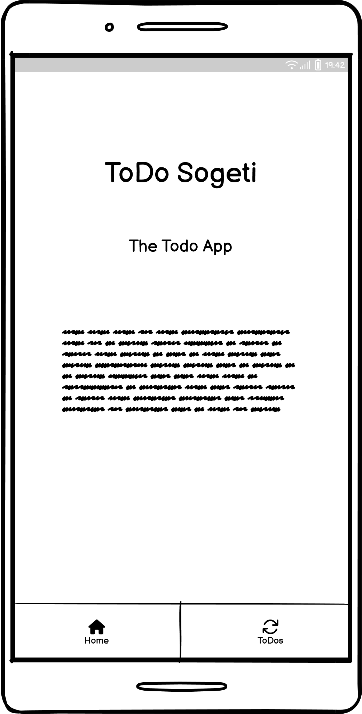 | 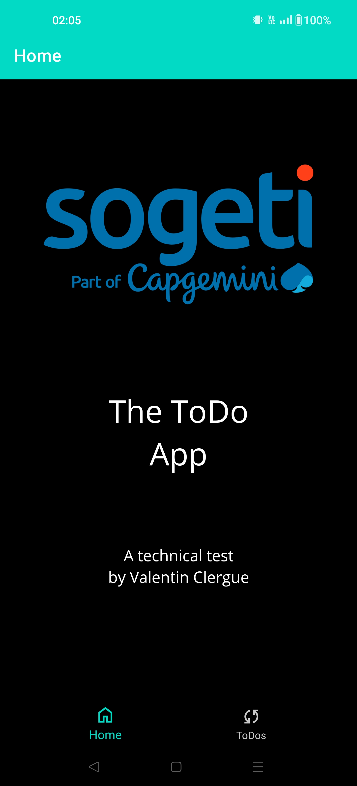 |
| 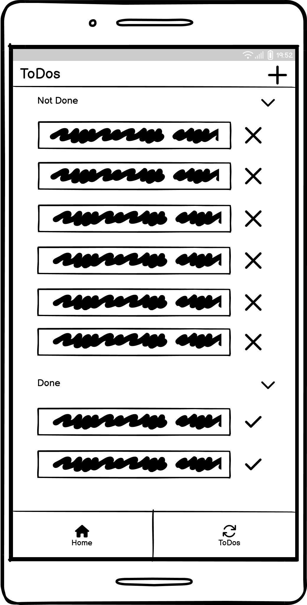 | 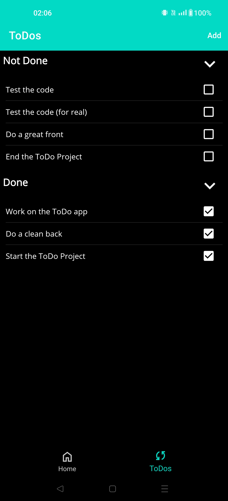 | 
| 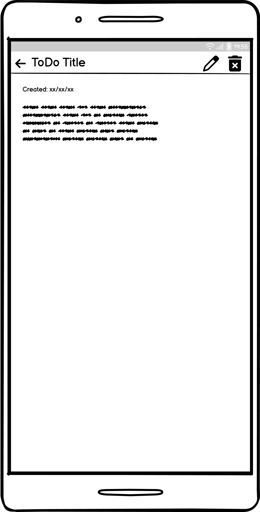 | 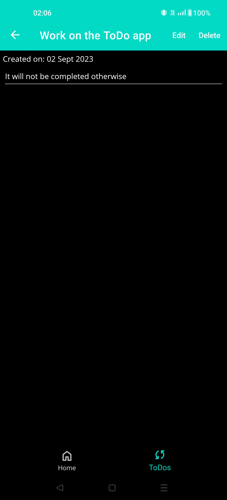 | 
| 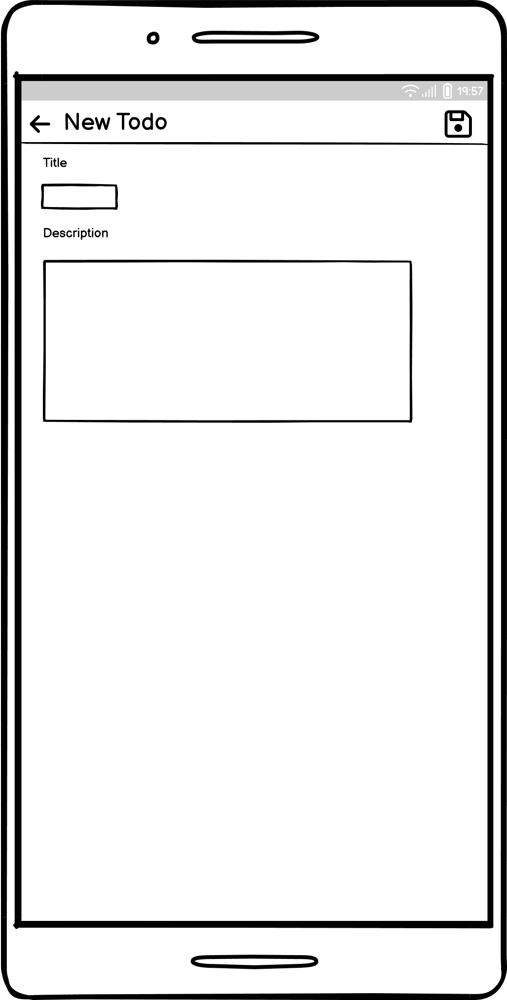 | 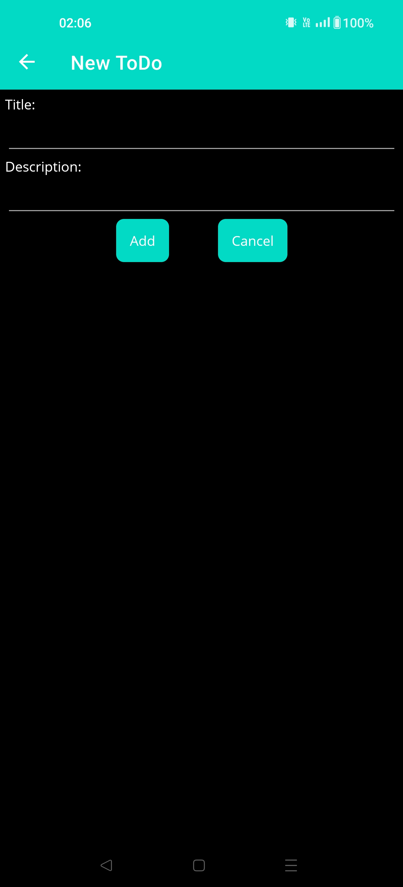 | 
|  | 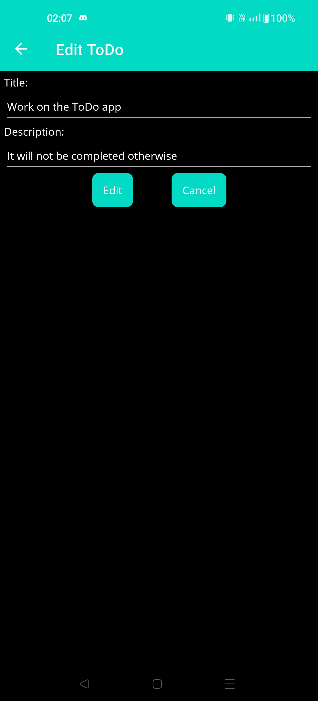 | 

## ⚙️ Architecture

> Theses diagrams are not fully accurate and only gave the global idea of the conception.

 Model 

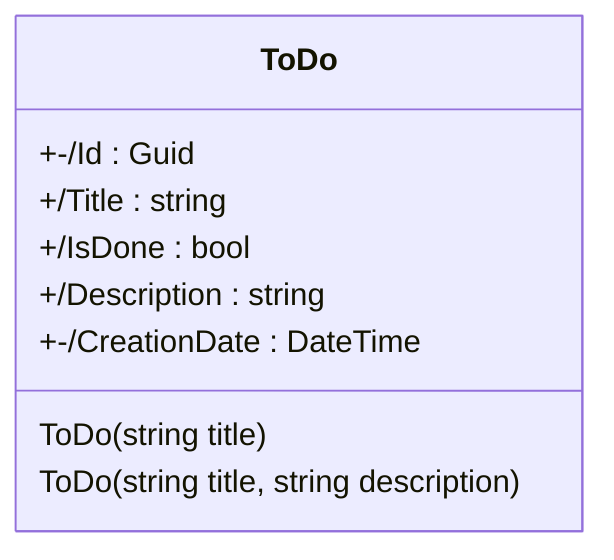

---

 ViewModels 

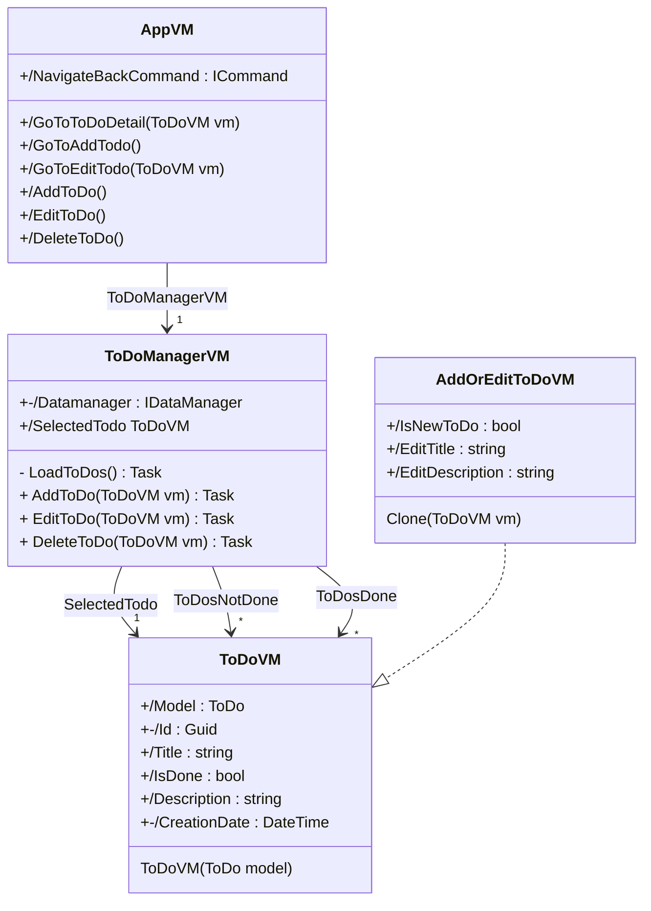

## ✍️ Credits 

* Author: [**Valetin Clergue**](https://github.com/HandyS11)