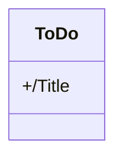
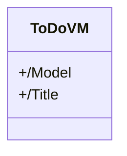

# TOTO_SOGETI

## 📝 Purpose

Create a **TODO** application to showcase developpement skills with [.NET](https://learn.microsoft.com/en-us/dotnet/)

You can find the context [here](./CONTEXT.md)

## 📊 Features

**Done:**
-  Setup the repo

**Not Done yet:**
- Create the Model
- Create the MAUI sample
- Create the VM
- Create the EF Model
- Create the MAUI front
- Link everything together

## 🛠 Languages & tools

## 🖊️ Versions 

- [.NET 7](https://learn.microsoft.com/en-us/dotnet/core/whats-new/dotnet-7)
- [Android API](https://developer.android.com/reference) 33

## 📍 Visuals

 Pages 

| Sketchs | App |
| --- | --- |
|  |  | 

## ⚙️ Architecture

> Theses diagrams are not fully accurate and only gave the global idea of the conception.

 Models 

---

 ViewModels 

## ✍️ Credits 

* Author: [**Valetin Clergue**](https://github.com/HandyS11)